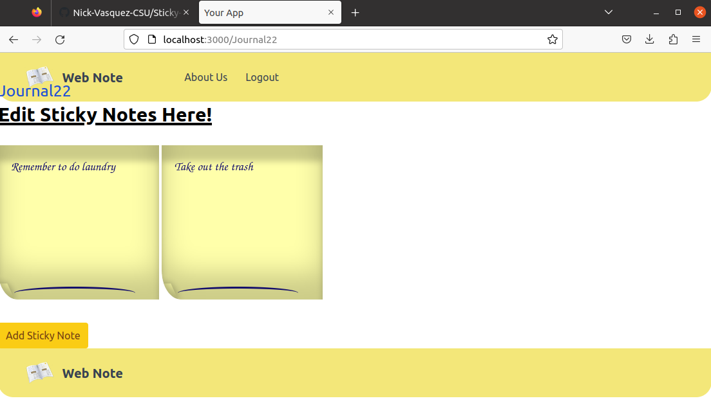

### Sticky-Note-Saver
| Group             |
|-------------------|
| Stephanie Pocci   |
| Emmanuel Salcedo  |
| Nick Vasquez      |
| Ramiro Aispuro    |

##### WHAT WE LEARNED
* How to wireframe, mockup, and prototype the front-end design of a website
* How to apply CSS styles to components and create layouts
* How to work within the Tailwindcss framework
* How to work with JSON as a data format
* How to utilize low-code tools to create working prototypes of a product
* How to create conditional statements within the Remake framework
* How to segue between multiple pages of a website within the Remake framework
* How to create specific HTML elements dynamically according to the input of the user
* Tools: NodeJS, TailwindCSS, Remake, Javascript, HTML, Wireframe.cc

##### HOW TO RUN THE PROJECT
* The application runs through a linux environment
1. Download the repository and store it within your desired folder
2. Install the latest version of Node.js: **`curl -s -L http://git.io/n-install | bash -s -- -y`** **`. $HOME/.bashrc`**
3. Run the following command in the terminal under the repository's directory: **`npm install -D npm-run-all`**
4. Run the following command: **`npm start`**
5. Go to the localhost link that the terminal provides you and play around with our product in the browser!
